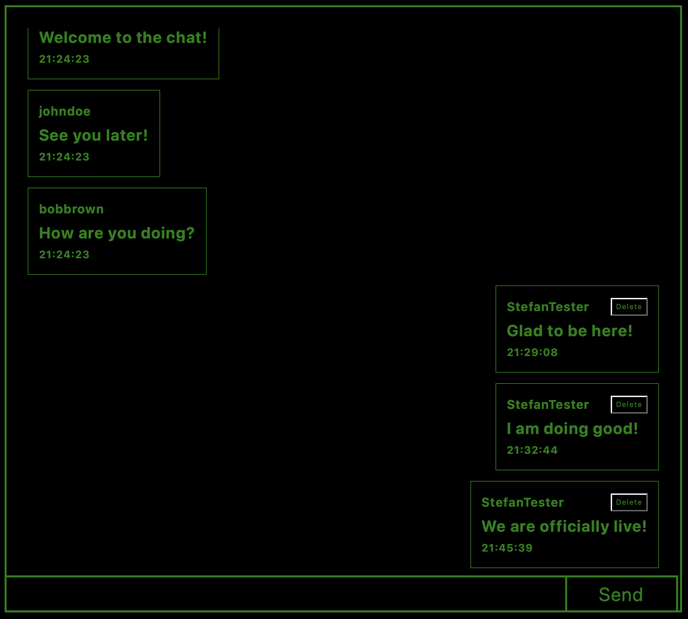

# Members-Only
An anonymous messaging platform where anyone can read posted messages, but only authenticated users can create messages and view the identities of message senders.

The application is built entirely on the server side using EJS for rendering and follows the MVC design pattern. It leverages Express.js as the web framework, PostgreSQL for data storage, express-validator for validating user input, express-session for session management, and passport and pg-connect-simple for authentication.

#### You can check out the app using the link in the sidebar or by clicking [here](https://members-only-2irw.onrender.com)!

##### Deployment from [render!](https://render.com)
##### Database from [neon!](https://neon.com)